# Architecture

AeroGNC-Lab separates deterministic engineering models from orchestration, data
products, and optional external validation. Dependencies point inward: dynamics
depends on mathematical interfaces and passed-in force/moment values, never on a
plotter, CLI, or proprietary runtime.

```mermaid
flowchart TB
  subgraph Inputs
    YAML[Scenario and vehicle YAML]
    Seed[Explicit random seed]
    Workbench[Unified desktop workbench]
    Project[Versioned engineering project]
    Mesh[Bounded visual OBJ / STL]
  end
  subgraph GNC
    Guide[Reference guidance]
    Nav[Navigation estimator]
    Strap[Rotating strapdown INS]
    Delay[Fixed-lag delayed ESKF]
    Control[PID / state feedback]
    Envelope[Trim / linear models / gain schedule]
    Governor[Constrained ascent governor]
  end
  subgraph Vehicle
    Prop[Propulsion and mass properties]
    Aero[Aerodynamic coefficient provider]
    AeroDB[N-D coefficient database]
    Act[Actuator dynamics]
    Sensors[Sampled sensors]
    FixedWing[Coefficient-driven fixed wing]
  end
  subgraph Environment
    ISA[ISA atmosphere]
    Grav[Gravity]
    Wind[Deterministic / stochastic wind]
    Geodesy[Ellipsoid / ECEF / rotating planet]
    OrbAtm[Reference orbital atmosphere]
  end
  subgraph Simulation
    Orch[Orchestrator]
    RK4[Custom RK4]
    Events[Event manager]
    Plant[3-DOF / 6-DOF plant]
    AircraftPlant[18-state aircraft plant]
    OrbitSandbox[Free / 2-body / 3-body / N-body / decay]
    Live[Keyboard / optional XInput live player]
    Loopback[Packet-level software loopback / watchdog]
  end
  subgraph Astrodynamics
    Designer[Guided Mission Designer]
    Ephem[Elliptical / table / optional SPICE ephemerides]
    Lambert[Kepler / elements / Lambert / porkchop]
    Window[Constrained launch-window refinement]
    Tour[Capture / parking orbit / departure tour]
    TimeFrame[UTC/TAI/TT/TDB and J2000 frames]
    Exchange[CCSDS OEM / GMAT interface]
    FMI[FMI 3.0 controller contract]
    BPlane[B-plane / multi-leg correction]
    Burns[Impulses / finite burns / mass]
    RNBody[Restricted N-body plant]
    FNBody[Full mutual N-body verification]
    Perturb[J2 / SRP / relativity]
  end
  subgraph AstronomyData
    Galaxy[Milky Way context]
    Exoplanets[NASA confirmed-exoplanet snapshot]
    Solar[Eight Solar System planets]
  end
  subgraph Evidence
    Manifest[Run manifest / provenance]
    Store[Atomic result store]
    Compare[Run comparison / HTML report]
    Log[Structured result]
    Verify[Analytical and numerical checks]
    FlightData[Clock alignment / robust identification]
    Plot[Publication-style figures]
    MC[Monte Carlo statistics]
  end

  YAML --> Orch
  Project --> Orch
  Workbench --> Project
  Workbench --> Orch
  Seed --> Orch
  Guide --> Control --> Act --> Plant
  Control --> Loopback --> Plant
  Control --> FMI
  Envelope --> Control
  Guide --> Governor --> Plant
  Plant --> Sensors --> Nav --> Guide
  Sensors --> Strap --> Delay --> Nav
  Prop --> Plant
  Aero --> Plant
  AeroDB --> Aero
  FixedWing --> AircraftPlant
  Act --> AircraftPlant
  OrbAtm --> AircraftPlant
  Grav --> AircraftPlant
  Live --> AircraftPlant
  Mesh --> Live
  ISA --> Aero
  Grav --> Plant
  Geodesy --> Grav
  Wind --> Aero
  Orch --> RK4 --> Plant
  YAML --> Designer --> Lambert --> BPlane
  Lambert --> Window
  Lambert --> Tour
  Workbench --> Tour
  TimeFrame --> Exchange
  Tour --> Exchange
  Galaxy --> Exoplanets
  Solar --> Exoplanets
  Exoplanets --> Plot
  Workbench --> Exoplanets
  YAML --> Ephem --> RNBody
  Burns --> RNBody
  Perturb --> RNBody
  BPlane --> RNBody
  Ephem --> FNBody
  RK4 --> RNBody
  RK4 --> OrbitSandbox
  RNBody --> OrbitSandbox
  FNBody --> OrbitSandbox
  Perturb --> OrbitSandbox
  OrbAtm --> OrbitSandbox
  Workbench --> OrbitSandbox
  Workbench --> Live
  RNBody --> Log
  Events --> Orch
  Orch --> Log
  Orch --> Manifest --> Store --> Compare
  Log --> Store
  Log --> Verify
  Log --> FlightData --> Verify
  Log --> Plot
  MC --> Orch
```

## Key interfaces

- **Configuration:** YAML is parsed once into validated, typed dataclasses. Unknown
  keys and non-physical values fail with contextual messages.
- **Engineering project:** a versioned, portable project resolves safe relative paths
  and invokes registered workflows. Immutable manifests and an atomic indexed result
  store make UI and CLI runs reproducible and comparable. The normative lifecycle is
  defined in [Engineering Workspace Architecture](engineering_workspace.md).
- **Models:** environment and vehicle components are side-effect-free where
  practical. Stochastic models own an explicitly seeded generator.
- **Dynamics:** derivative functions accept time, state, and explicit model inputs.
  This keeps analytical tests independent from a full scenario.
- **Atmospheric flight extensions:** the rotating-planet 6-DOF composition propagates
  inertial translation and `q_ib` while deriving ECEF/geodetic/NED diagnostics.
  Ordered staging, deployable recovery, and provenance-checked engineering-data
  imports are independent vehicle services that can be composed without changing the
  baseline regressions.
- **Simulation:** fixed-step RK4 remains the regression baseline; adaptive
  Dormand--Prince 5(4) adds tolerance control, dense event bisection, checkpoint
  restart, and variational propagation. A deterministic logical-time scheduler
  coordinates multi-rate tasks. Solvers never write plots or files.
- **Astrodynamics:** an independent primary-centred state uses prescribed analytical
  planetary ephemerides and direct/indirect restricted N-body acceleration. It shares
  the custom RK4 and structured logging boundary but not the atmospheric plant.
  Preliminary Kepler/Lambert/B-plane design remains visibly distinct from propagated
  restricted N-body evidence. A separate mutual N-body model checks conservation.
  Orbit-tour accounting and launch-window refinement compose the same transparent
  Lambert/Kepler primitives. Time/frame conversion and CCSDS/GMAT exchange remain
  explicit boundary services, never hidden inside force models.
- **Astronomy data:** provenance-tagged Milky Way context, the eight Solar System
  planets, and a checksummed NASA confirmed-exoplanet snapshot feed read-only
  browsing and evidence plots. Sparse observational rows are never silently promoted
  to complete simulation ephemerides or interstellar trajectories.
- **Desktop UI:** Tk inputs are converted into the same typed rocket, satellite-orbit,
  coefficient-driven aircraft, tour, catalog, or planner requests used by tests. The
  two new beginner pages keep model selection and starting conditions visible while
  satellite drag/correction/numerical inputs and aircraft coefficient/mass/wind inputs
  remain collapsed until requested. A bounded OBJ/STL file changes visual geometry
  only; the validated engineering fields remain the physical model. The project tab
  delegates open/save/validation,
  scenario execution, cancellation, history, comparison and report generation to a
  UI-independent facade over the shared project service. Batch calculations run off
  the Tk event thread; 3D playback consumes immutable results. The live aircraft player
  deliberately evaluates the same nonlinear derivative at a deterministic fixed step
  while accepting keyboard or optional neutral-on-failure XInput commands. Observational data stay
  read-only, and optional ephemerides are loaded lazily and never silently substituted.
  The retained-framework analysis and measured local-web comparison are documented in
  the [UI architecture decision](ui_architecture_decision.md).
- **SIL/future HIL boundary:** versioned typed packets, CRC, wrap-aware receiver,
  independently seeded impairment links, logical deadlines, and a fail-silent
  command watchdog are exercised in logical time and through a separately scoped,
  source-filtered localhost UDP adapter. Neither workflow claims hard real-time or
  physical-HIL evidence. The FMI XML is an
  interface contract only; mandatory C runtime, packaging, official validation, and
  external execution remain pending.
- **GNC:** controller interfaces consume estimates/references and produce bounded
  actuator commands; they can run against a simulated or future external plant.
  Analysis functions consume generic nonlinear dynamics to produce trim points,
  perturbation models, LQR designs, modes, margins, identification and SIL timing.
  The envelope layer composes the real synthetic aero/mass/environment interfaces,
  builds a three-variable interpolated gain schedule, and verifies between-grid and
  uncertain models. Constrained ascent keeps offline reference search separate from
  the online max-Q/load/angle governor.
- **Geodesy:** the optional rotating flight path integrates ECEF states and logs
  geodetic/local-NED diagnostics. Frame transforms contain geometry only; gravity,
  \(J_2\), Coriolis, and centrifugal acceleration remain explicit dynamics inputs.
- **Evidence:** visualisation, flight-test processing, and Monte Carlo analysis
  consume immutable result records.
- **Advanced navigation:** timestamped IMU increments feed a rotating-frame strapdown
  nominal state. Delayed GNSS-like/barometric records are corrected at retained
  snapshots and later records are replayed; gating and health logic remain inside the
  estimator rather than the plant.
- **Flight-data identification:** independent command and sensor CSV records cross the
  file boundary before alignment, cleaning, robust fitting, residual testing, and
  held-out prediction. Synthetic truth is used only by requirement assessment.

## Performance design

Single trajectories favour clarity and traceability. Ensemble execution uses
process-based parallelism only at run boundaries; each run receives an independent
seed generated deterministically from the master seed. Array allocation is avoided
inside the highest-frequency loops where it would obscure timing, while premature
micro-optimisation is excluded. Runtime metrics are recorded for controller and
ensemble comparisons.

## Safety boundary

Guidance produces only a time-indexed research-ascent attitude/reference schedule.
No interface accepts target states or computes interception, pursuit, terminal
homing, or engagement commands.
