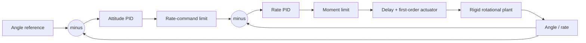

# Guidance and Control Architecture

All guidance and control examples are confined to fictional civilian research-rocket
ascent and attitude stabilisation. No interface accepts a target state; interception,
pursuit, proportional navigation against a target, terminal homing, and engagement
logic are deliberately absent.

## Reference guidance

The guidance layer is a clamped, piecewise-linear time schedule of aerospace 3-2-1
roll, pitch, and yaw references. It converts each reference into the normative
body-to-navigation quaternion. This is a configurable academic pitch/attitude
schedule, not an operational trajectory-guidance law.

## Cascaded attitude and rate control

The scalar verification plant uses an outer attitude loop and inner angular-rate
loop:

The direct PID implementation includes a filtered derivative, integrator bounds,
conditional integration, back-calculation, and output limiting. The benchmark uses
the same time constant, rate, position, and delay effects as the reusable actuator
model.

## Quaternion attitude hold

The 6-DOF scenario computes the shortest-path quaternion error

\[
q_e=q_{nb}^{-1}\otimes q_{nb,ref},\qquad
\mathbf e_\theta\simeq 2\,\operatorname{vec}(q_e),
\]

with quaternion sign chosen so its scalar part is nonnegative. Requested body moment
is

\[
\mathbf M_c=K_p\mathbf e_\theta-K_d\boldsymbol\omega,
\]

then component-limited, allocated through the fictional diagonal effectiveness map,
and passed through three bounded actuator dynamics. Gains are synthetic and intended
to show architecture and verification--not flight-ready design.

## Manual state feedback

The comparison controller uses \(u=-K(x-x_r)\). For the controllable SISO benchmark,
\(K\) is calculated directly with Ackermann's formula:

\[
K=e_n^T\mathcal C^{-1}\phi(A),\qquad
\mathcal C=[B\ AB\ \ldots\ A^{n-1}B].
\]

The achieved closed-loop eigenvalues are tested against requested poles. The method
is transparent but less numerically robust than Schur-based pole placement and is
therefore scoped to small, well-conditioned educational models. An optional linear
gain schedule interpolates manually supplied gains with explicit endpoint clamping.

## Quantitative comparison

The reproducible `attitude` CLI reports rise time, 2% settling time, overshoot, RMS
and maximum tracking error, squared-moment control effort, actuator-saturation time,
post-disturbance recovery, and measured controller execution time. The current
synthetic benchmark gives:

| Controller | Rise [s] | Settle [s] | Overshoot | Recovery [s] |
|---|---:|---:|---:|---:|
| Cascaded PID | 0.755 | 2.495 | 7.86% | 0.940 |
| State feedback | 1.410 | 2.740 | 0.00% | 0.485 |

These values are regression evidence for the configured plant, not general flight
performance claims.

## Trim, LQR, margins, identification, and SIL timing

The `flight-analysis` workflow adds bounded nonlinear trim, central-difference
linearisation, controllability/observability matrices, modal metrics, manual
Hamiltonian LQR, an inertia-indexed gain schedule, state-space frequency response,
classical stability margins, continuous state-space identification, and measured
Python controller timing. The LQR solution is compared against SciPy's independent
Riccati solver in tests. Full equations, configuration, and limitations are in the
[flight-control analysis](flight_control_analysis.md).

## Flight-envelope schedule and ascent constraint manager

The multidimensional envelope workflow trims the nonlinear pitch plant at configured
Mach, altitude, and mass nodes, linearises it with central differences, solves the
continuous-time Riccati equation through a manual Hamiltonian eigenspace method, and
interpolates the resulting gains. Every scheduled node is checked for controllability,
observability, stability, and remaining actuator authority; midpoint interpolation and
seeded uncertain plants are checked separately. Details and declared validity bounds
are in [flight-envelope analysis](flight_envelope.md).

The constrained-ascent example keeps offline schedule selection separate from the
online command governor. The governor bounds throttle and pitch reference using
maximum dynamic pressure, powered-flight normal-load, aerodynamic-angle, and desired
apogee margins. These limits apply only to the documented fictional case and are not
an operational trajectory law. See
[constrained ascent guidance](constrained_ascent_guidance.md).
