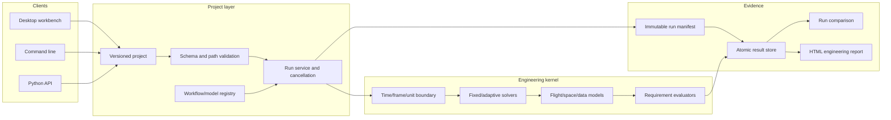

# Engineering Workspace Architecture

## Purpose

The engineering workspace turns AeroGNC-Lab's verified individual workflows into a
repeatable analysis product. A project is configuration and provenance, not mutable
simulation state. A run is immutable evidence produced from one project scenario.
The desktop UI and command line call the same project service.

## Project contract

The YAML project schema has an explicit version. Configuration paths and the result
directory are resolved relative to the project file, must remain inside the project
root, and are never inferred from the process working directory. Scenario names are
unique and workflow names are registry keys. Unknown keys are errors. These rules
make a project portable and protect a desktop user from accidentally writing outside
the selected workspace.

## Run lifecycle

1. Load and validate the project without executing models.
2. Resolve one enabled scenario and calculate hashes for every declared input.
3. Create a run request with an explicit seed and solver options.
4. Execute through a registered workflow while honoring cancellation.
5. Build a manifest containing provenance, warnings, events, requirements, and
   artefact metadata.
6. Write a temporary run directory, validate it, atomically rename it, and update the
   local index in one transaction.
7. Reload stored channels for comparisons and reporting rather than retaining hidden
   UI objects.

Failed or cancelled work is recorded separately and is never presented as a complete
result. Measured runtime is retained as operational metadata but is excluded from
deterministic input fingerprints.

## Result contract

Each channel has a stable name, one SI or dimensionless unit, finite numeric samples,
and the same strictly increasing time base. Events and requirement outcomes are
structured records. CSV remains available for inspection; compressed NumPy storage
supports faster local reload. The manifest points to both and includes hashes.

## Extension boundary

Built-in workflows are registered explicitly. Optional Python entry points may
provide additional workflows against a versioned protocol, but discovery failures
are isolated and reported. Plugins do not gain an implicit ability to bypass project
path validation or alter completed runs. Third-party code is trusted local code, not
a sandbox.

## Product boundaries

- The observational exoplanet catalog remains read-only and is not an interstellar
  ephemeris.
- Real Solar System ephemerides are opt-in and provenance-tagged; synthetic
  regression scenarios remain the default.
- Software loopback, localhost UDP, and FMI interfaces are not physical HIL.
- No target interception, terminal homing, or engagement workflow is accepted by the
  registry.

