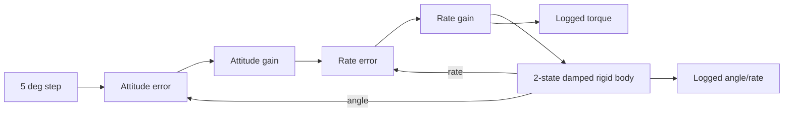

# Simulink Validation Interface

## Current status: not executed

The development machine has MATLAB R2024a Update 3 and returns a Simulink licence
response, but a 2026-07-20 release probe found no `sim` function/product files. Prior
`ver('simulink')` and `exist` probes were likewise empty. Consequently, no Simulink
numerical result is claimed in this release.

`simulink_validation/build_attitude_channel_model.m` is a programmatic model builder
for a deliberately small academic case. It uses only core Simulink blocks to create:

Both Simulink `.m` files, together with the two MATLAB validation scripts, passed
MATLAB R2024a `checkcode` with zero analyzer findings on 2026-07-20. This is syntax/
static-analysis evidence only and is not reported as model execution.



The plant state is \([\theta,q]^T\) with

\[
\dot\theta=q,\qquad
\dot q=\frac{u-cq}{I},
\]

using synthetic \(I=2.4\ \mathrm{kg\,m^2}\) and
\(c=0.8\ \mathrm{N\,m\,s/rad}\). A fixed-step `ode4` solver runs at 0.001 s.

When Simulink is installed, execute:

```matlab
addpath('simulink_validation');
run_attitude_channel_validation;
```

The script builds `aerognc_attitude_channel.slx`, executes it, and exports angle,
rate, and command signals plus an execution report under the ignored `output/`
directory. The builder intentionally fails with `AeroGNC:SimulinkUnavailable` if the
runtime is absent. A future release should independently reproduce the same plant in
Python and compare time-aligned signals before changing this status to executed.
