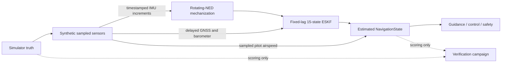

# Estimated Waypoint Navigation

## Scope and safety boundary

The estimated-navigation runtime is a deterministic, simulation-only integration of
the repository's sampled sensor models, rotating-NED strapdown mechanization, and
fixed-lag 15-state error-state Kalman filter (ESKF). It uses only fictional civilian
research-aircraft inputs and creates no physical sensor, radio, serial, actuator, or
aircraft interface.

Simulator truth is accepted only by the synthetic sensor boundary. The provider
returns a new `NavigationState` containing the estimate; guidance, control, mission
management, safety, structured logs, and provider diagnostics receive that state and
never receive an uncorrupted truth field. Truth appears separately in
`verification/waypoint_navigation.py` solely to score estimation error.

## Reproduce the workflows

```bash
# Fly the waypoint mission using estimated navigation on the 18-state plant
python -m aerognc.cli waypoint --config configs/waypoint_gnc_estimated.yaml

# Run the independent GNSS-outage/recovery scoring campaign
python scripts/verify_waypoint_navigation.py
```

The committed evidence is
[`results/reference/waypoint_navigation_dropout.json`](../../results/reference/waypoint_navigation_dropout.json).

## Information flow



The implementation deliberately has no path from the truth/scoring channel to the
controller after sensor generation.

## Sensor contract

Every `SensorMeasurement` stores its acquisition (`sample_time_s`) and availability
(`available_time_s`) epochs plus a finite vector value. Each configured sensor has:

- sample rate;
- white-noise standard deviation;
- constant bias and bias random walk;
- quantization;
- delivery latency;
- seeded random dropout probability; and
- scheduled availability/dropout intervals.

`configs/waypoint_gnc_estimated.yaml` configures 20 Hz gyroscope and accelerometer,
2 Hz GNSS with 0.15 s latency, 10 Hz barometer with 0.10 s latency, and 10 Hz
airspeed. GNSS is deliberately unavailable from 70 through 90 s. Sensor periods and
latencies must be integer multiples of the 0.05 s navigation step; invalid timing is
rejected before simulation.

## Estimator and delayed updates

The nominal state contains geodetic position, NED velocity, a Hamilton scalar-first
body-to-NED quaternion, gyro bias, and accelerometer bias. Its local error state is:

\[
\delta x = [\delta p_n,\;\delta v_n,\;\delta\theta_b,\;\delta b_g,\;\delta b_a]^T.
\]

The mechanization removes estimated biases, applies body and navigation-frame
rotation, gravity, and transport acceleration, and propagates the covariance at the
IMU rate. GNSS position/velocity and barometric altitude updates are applied at their
acquisition epoch. Accepted later updates are retained while the filter replays IMU
increments to the current epoch.

Normalized innovation squared (NIS) gates are configured independently for GNSS and
barometer. Consecutive rejections drive `healthy -> degraded -> failed`; an accepted
measurement resets the counter to healthy. Provider validity also checks IMU/GNSS/
airspeed age and horizontal/vertical position covariance. The controller sees only
the resulting `valid` flag and estimated state.

Run metadata records the complete sensor, seed, process-noise, fixed-lag, and gate
configuration. End-of-run diagnostics record covariance, minimum eigenvalue,
maximum standard deviations, measurement age, replay count, accepted/rejected
updates, and health. They intentionally contain no truth-error metrics.

## Initialization and determinism

Initialization applies seeded position, velocity, and attitude alignment errors to
the first simulated condition, starts from configured bias estimates, and uses an
explicit positive-definite 15-state covariance. `reset()` reconstructs every random
generator, sensor queue, filter state, counter, and timestamp. Equal configuration,
truth sequence, and seed therefore produce byte-identical estimates and evidence.

## Executed acceptance evidence

The 120 s verification trajectory contains a continuous coordinated turn and gentle
climb. Its truth and estimate are compared only in the scoring module. With GNSS
absent for 20 s, the committed result is:

| Metric | Measured | Acceptance |
|---|---:|---:|
| Pre-outage position RMS | 0.376 m | <= 3.0 m |
| Maximum outage position error | 9.109 m | <= 15.0 m |
| Recovery position RMS | 0.355 m | <= 3.0 m |
| Recovery velocity RMS | 0.061 m/s | <= 0.5 m/s |
| Maximum observed GNSS age | 20.45 s | 19.5-21.0 s |
| Minimum covariance eigenvalue | 9.38e-9 | >= -1e-9 |

All estimates remain valid, GNSS health recovers to healthy, and covariance remains
positive semidefinite. The configured full waypoint mission also completes on the
coefficient-driven 18-state plant in 181.5 s without a safety event.

## Limitations

- This is research simulation evidence, not navigation or flight certification.
- The waypoint integration does not yet model magnetometer, terrain, multipath,
  lever-arm, correlated atmosphere, or operational receiver effects.
- Heading is propagated from gyro mechanization and aided indirectly through vehicle
  motion; there is no dedicated magnetic-heading update.
- The provider's synthetic reference planet is nonrotating and gravity-matched at
  the local origin so reduced and coefficient-driven waypoint plants share one
  estimator contract. The underlying strapdown/ESKF implementation separately has
  rotating-oblate-planet validation.
- Truth-error values must remain confined to verification code and must not be added
  to runtime provider diagnostics or controller-facing telemetry.
