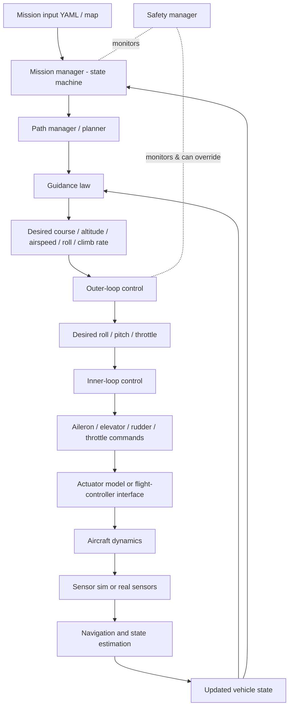

# Implementation Plan & Architecture — Waypoint Fixed-Wing GNC

_Companion to `inspection_report.md` and `../../TODO.md`._

## Target information flow



## Layer → module map

| Layer | Module(s) | Status |
|---|---|---|
| Mission | `mission/waypoint.py`, `mission/mission.py`, `mission/mission_io.py`, `mission/mission_manager.py`, `mission/edits.py` | models+IO done; manager/edits pending |
| Planning | `gnc/path_manager.py` | pending |
| Guidance | `gnc/waypoint_guidance.py` (`GuidanceLaw` ABC, backends) | pending |
| Navigation | `navigation/state.py`, `navigation/providers.py` (reuse `gnc/*` filters) | pending |
| Control | `gnc/fixedwing_autopilot.py` (reuse `gnc/pid`, `gnc/control_loops`) | pending |
| Dynamics | reuse `dynamics/`, `vehicle/fixed_wing.py` | reuse |
| Actuators | extend `vehicle/actuators.py` (`vehicle/control_surfaces.py`) | pending |
| Sensors | reuse `vehicle/sensors.py`, `sensor_faults.py` | reuse |
| Safety | `mission/safety.py` | pending |
| Simulation | `simulation/waypoint_mission.py` | pending |
| External | `simulation/backends/{base,internal,jsbsim,mavlink}.py` | pending |
| Visualization | `visualisation/mission_planner_map.py`, reuse `style.py` | pending |
| Logging | reuse `simulation/logging.py`, `project/` manifest patterns | reuse |
| Configuration | `configuration/*_loader.py` additions | pending |
| Testing | `tests/{unit,integration,validation}` | ongoing |
| Geometry | `mathematics/local_frame.py` (+ reuse `geodesy.py`, `quaternion.py`) | done |

## Key interfaces (contracts to hold stable across sessions)

```python
class GuidanceLaw(ABC):
    def update(self, vehicle_state, path_segment, environment, dt) -> GuidanceCommand: ...

class VehicleBackend(ABC):
    def initialize(self, config): ...
    def read_state(self): ...
    def send_actuator_commands(self, command): ...   # not all backends accept raw actuators
    def send_guidance_command(self, command): ...
    def step(self, dt): ...
    def shutdown(self): ...
```

`GuidanceCommand`: course/heading/altitude/airspeed/climb-rate/roll commands + cross-track,
along-track, distance-to-waypoint diagnostics. `ControlCommand`: roll/pitch/throttle.
`ActuatorCommand`: aileron/elevator/rudder/throttle (normalized + physical).

## Design rules (repo-consistent)

1. Reuse before rewrite; retain existing LQR/state-feedback/EKF as selectable backends.
2. SI everywhere; radians internally; degrees only at YAML/UI edges.
3. Frames explicit in names; never conflate ground course vs body yaw, airspeed vs
   groundspeed, altitude vs down.
4. No global mutable state; frozen dataclasses for value types; validate in `__post_init__`.
5. Fixed-wing physics: no instantaneous heading change — use coordinated-turn radius
   `r = v²/(g·tan φ)` with a φ→0 guard; turn anticipation before waypoints.
6. Optional deps (pymavlink/JSBSim) imported lazily and feature-flagged.
7. Real-hardware output OFF by default; autonomous landing OFF by default.
8. Ship tests + docs with each module (coverage ≥ 75%).

## Verification strategy

Unit (geometry, models, PID, path, completion, safety) → integration (full chain) →
17 seeded scenario tests (spec §26) → keep mypy/ruff/coverage green.

## Milestone acceptance (spec §27) — target end-state

Set home on map; add ≥3 waypoints; edit alt/airspeed/radius/action; save/load; aircraft
flies to and sequences waypoints; auto roll/pitch/yaw/throttle; loiter; return home;
planned+actual tracks drawn; live control/actuator/mission data shown; wind toggle; safety
enforced; tests pass; no hardware commanded by default; docs explain the full workflow.
