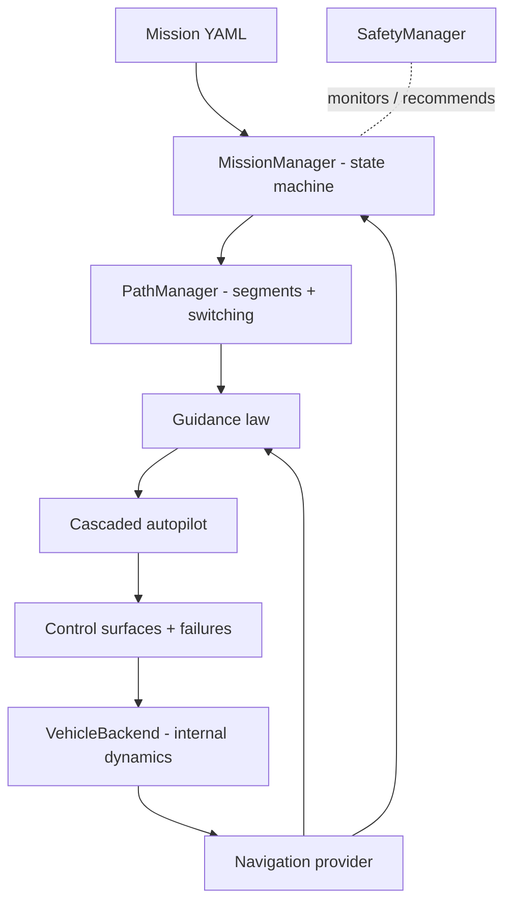

# Waypoint Fixed-Wing GNC — User & Developer Guide

> **Safety.** This workflow is **designed for simulation, SITL validation, and
> progressive preparation for hardware integration.** It is not flight-certified,
> and it commands no real aircraft. Autonomous landing is not enabled. Real-vehicle
> output requires an explicit opt-in that does not yet exist in this build.

## What it does

Plan a fixed-wing mission as an ordered list of waypoints, then fly it in the
internal simulator. The GNC chain automatically computes desired course, heading,
altitude, airspeed, roll/pitch, and the aileron/elevator/rudder/throttle commands,
sequences the waypoints (including loiter and return-home), enforces a safety
envelope, and logs everything.

## Quick start

```bash
# Validate a mission (schema + flight-envelope checks)
python -m aerognc.cli mission validate missions/waypoint_demo.mission.yaml

# Fly it in the internal simulator (writes CSV + JSON log and a PNG dashboard)
python -m aerognc.cli waypoint --mission missions/waypoint_demo.mission.yaml \
    --guidance vector_field --output results/waypoint_gnc

# Add a steady crosswind and try a different guidance law
python -m aerognc.cli waypoint --mission missions/waypoint_demo.mission.yaml \
    --guidance l1_guidance --wind-east-mps 6
```

The bundled `missions/waypoint_demo.mission.yaml` flies
`navigate → loiter → return-home → complete` in ~248 s with a final cross-track
error of ~0.07 m and bounded airspeed.

## Mission file format (schema version 1)

```yaml
mission_version: 1
mission:
  name: waypoint_demo
  description: Basic autonomous fixed-wing mission.
home:
  latitude_deg: 39.925
  longitude_deg: 32.8369
  altitude_m: 0.0
defaults:            # applied to waypoints that omit these fields
  airspeed_mps: 20.0
  acceptance_radius_m: 30.0
  altitude_tolerance_m: 10.0
limits:              # safe flight envelope used for validation
  min_altitude_m: 0.0
  max_altitude_m: 3000.0
  min_airspeed_mps: 12.0
  max_airspeed_mps: 45.0
  max_bank_deg: 45.0
waypoints:
  - id: 1
    name: WP1
    latitude_deg: 39.927
    longitude_deg: 32.840
    altitude_m: 120.0
    altitude_reference: relative_home   # relative_home | msl | agl
    action: fly_through                 # see actions below
  - id: 2
    name: WP2
    latitude_deg: 39.930
    longitude_deg: 32.847
    altitude_m: 180.0
    airspeed_mps: 22.0
    action: loiter
    loiter_radius_m: 100.0
    loiter_duration_s: 60.0
    loiter_direction: clockwise         # clockwise | counterclockwise
  - id: 3
    name: HOME_RETURN
    latitude_deg: 39.925
    longitude_deg: 32.8369
    altitude_m: 100.0
    action: return_home
```

**Actions:** `fly_through`, `turn`, `loiter`, `hold`, `change_altitude`,
`change_airspeed`, `takeoff`, `land`, `return_home`, `mission_end`.
(Takeoff and land are reserved and disabled by default.)

**Validation** rejects: latitude ∉ [-90, 90], longitude ∉ [-180, 180], altitude
outside the configured band, airspeed outside the safe envelope, non-positive
radii, a loiter radius below the minimum coordinated-turn radius
`r = v² / (g·tan φ)`, and duplicate waypoint ids.

## Using it as a library

```python
from aerognc.mission import load_mission
from aerognc.gnc.waypoint_guidance import GuidanceMode
from aerognc.simulation.waypoint_mission import run_waypoint_mission, WaypointMissionConfig

mission = load_mission("missions/waypoint_demo.mission.yaml").validate()
result = run_waypoint_mission(
    mission,
    WaypointMissionConfig(guidance_mode=GuidanceMode.VECTOR_FIELD, wind_ned_mps=(0, 4, 0)),
)
print(result.summary())            # outcome, cross-track, altitude/airspeed bounds
result.to_csv("results/waypoint_gnc/log.csv")
```

## Architecture (information flow)



| Layer | Module |
|---|---|
| Mission models & I/O | `aerognc.mission` (`waypoint`, `mission`, `mission_io`) |
| Geometry | `aerognc.mathematics.local_frame` |
| Planning | `aerognc.gnc.path_manager` |
| Guidance | `aerognc.gnc.waypoint_guidance` |
| Control | `aerognc.gnc.fixedwing_autopilot` |
| Actuators | `aerognc.vehicle.control_surfaces` |
| Navigation | `aerognc.navigation` (`state`, `providers`) |
| Mission state / safety | `aerognc.mission.mission_manager`, `aerognc.mission.safety` |
| Backend / runner | `aerognc.simulation.waypoint_backends`, `aerognc.simulation.waypoint_mission` |
| Visualization | `aerognc.visualisation.waypoint_mission` |

## Conventions

- **Frames:** NED navigation, FRD body, Hamilton `quaternion_nb`. Ground **course**
  (direction of travel) and body **heading** (nose direction) are kept separate;
  wind correction applies only to the heading command.
- **Units:** strict SI internally; latitude/longitude in degrees only at the YAML
  boundary. Surface commands are normalized `[-1, 1]`, throttle `[0, 1]`, with the
  convention: positive aileron → roll right, positive elevator → pitch up, positive
  rudder → yaw right.

## Testing

```bash
python -m pytest tests/unit tests/integration/test_waypoint_mission.py
```

## Known limitations

- The internal backend is a **reduced 6-DOF-lite** control-design model, not a
  validated flight-dynamics plant. The project's 18-state `vehicle/fixed_wing.py`
  is the intended higher-fidelity backend (integration hook).
- Takeoff, autonomous landing, TECS, full EKF-estimated navigation, the interactive
  map planner, and the SITL/MAVLink backends are scoped but deferred — see
  `../../TODO.md` and `sitl_hardware_roadmap.md`.
